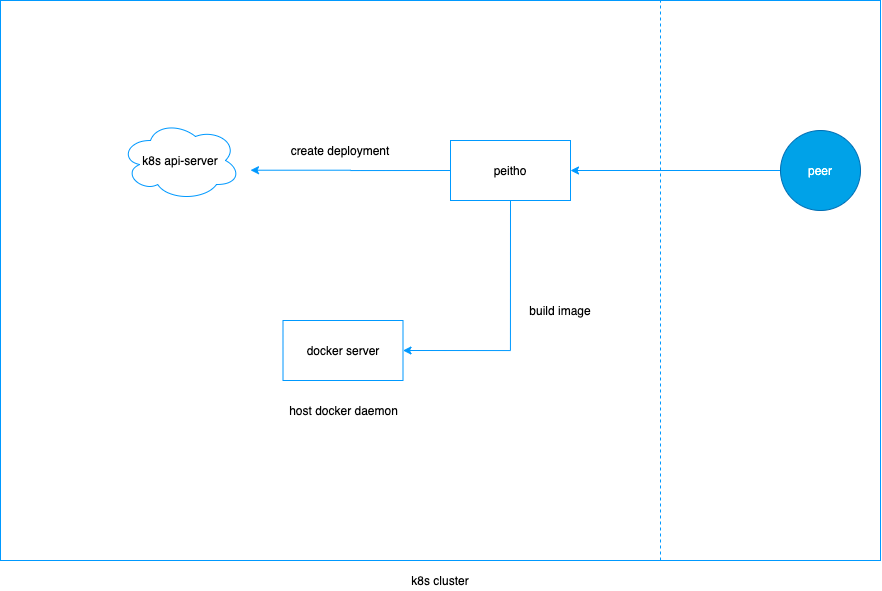
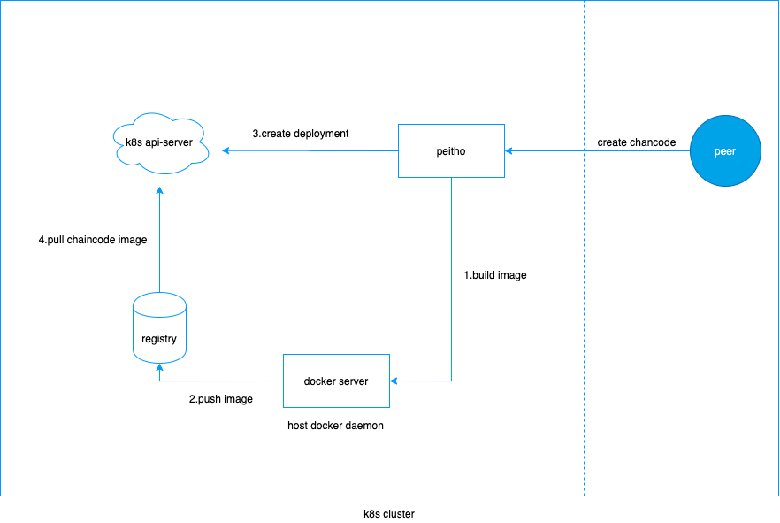
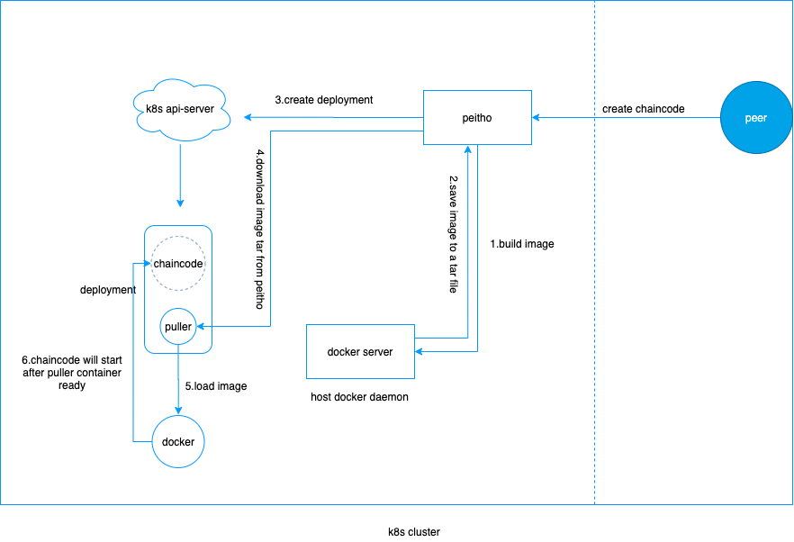

# Peitho - Hyperledger Fabric chaincode Cloud-native managed system

The chaincode of Hyperledger Fabric can be handed over to k8s for management, which is suitable for deploying the Hyperledger Fabric alliance chain on k8s, and solves the problem of chaincode being free from k8s control.

[简体中文](./README_zh.md)
## Features
- K8s fully managed chaincode
- There is no intrusion to the fabric, just configure the CORE_VM_ENDPOINT environment variable to Peitho service.
- Support fabric 1.4.x 2.0 and above
- Chaincode mirroring supports two mirror distribution modes: registry central(like harbor) mode and self delivery mode
- Support auto clean chaincode when fabric removed
## How Peitho achieve
### Architecture

### Two prcoess
peitho has two modes, one is mirror center mode and the other is self-distribution mode
1. registry mode, after the chaincode image is built, it will be pushed to the registry
   
2. self delivery mode, after the chaincode image is built, it is saved in peihto. The initial container puller in the deployment will download the image from peihto and use docker to load it to the local host.
   

## Getting Started
### Building
1.get source code
```shell
git clone https://github.com/tianrandailove/peitho
```
2.compile
```shell
cd peitho
make build
```
3.build image
```shell
make image
```
## Using
### Guarantee
> Building The chaincode image needs to use the two images: fabric-ccenv and fabric-baseos. Make sure that these two images can be pulled down by the host machine docker where the peitho service is located, so as to complete the chaincode image construction

> Through the environment variables of the peer (CORE_CHAINCODE_BUILDER, CORE_CHAINCODE_GOLANG_RUNTIME), you can customize the image tag of fabic-ccenv and fabric-baseos to tell pehito to pull
1. configure peitho-configmap.yaml
```yaml
# Copyright 2021 Ke Fan <litesky@foxmail.com>. All rights reserved.
# Use of this source code is governed by a MIT style
# license that can be found in the LICENSE file.

apiVersion: v1
data:
  kubeconfig: |-
    #k8s access configuration file
  peitho.yml: |-
    sweeper:
      enable: true # enable to auto clean died chaincode
      interval: 5 # check interval 
    peitho:
      imageMode: delivery #choose a mode: registry or delivery, if you choose registry, please configure docker.registry
      pullerAccessAddress: http://peitho:8080/tar #the address of peihto to download image tar
      pullerImage: x.x.x.x:8099/platform/puller-amd64:v-2-g5cada04 #image tag of puller, the initcontainer of chaincode deployment
    k8s:
      namespace: fabric #namespace 
      kubeconfig: /root/kube/kubeconfig #k8s access configuration file path
      dns: #If the chaincode and the peer are not in the same environment, the peer address resolution needs to be configured
        - 127.0.0.1:peer0.org1.example.com
        - 127.0.0.1:peer1.org1.example.com
        - 127.0.0.1:peer0.org2.example.com
        - 127.0.0.1:peer1.org2.example.com
    docker:
      endpoint: unix:///host/var/run/docker.sock # docker access endpoint
      registry: #like harbor
        server-address: #registry server address
          xxx.xxx.xxx.xxx:xxxx
        project: #project name
          chaincode
        email: #email
          litesky@foxmail.com
        username: #username
          admin
        password: #password
          harbor

    log:
      name: peitho # Logger name 
      development: true # Whether it is a development mode. If it is in development mode, the stack trace will be performed on DPanicLevel.
      level: debug # Log level, the priority from low to high is: debug, info, warn, error, dpanic, panic, fatal.
      format: console # Supported log output format, currently supports console and json. The console is actually the text format.
      enable-color: true # Whether to enable color output, true: yes, false: no
      disable-caller: true # Whether to open the caller, if open, the file, function and line number of the call log will be displayed in the log
      disable-stacktrace: false # Whether to prohibit printing stack information at panic and above levels
kind: ConfigMap
metadata:
  name: peitho-configmap
  namespace: fabric

```
2. configure peitho-deployment.yaml
```yaml
# Copyright 2021 Ke Fan <litesky@foxmail.com>. All rights reserved.
# Use of this source code is governed by a MIT style
# license that can be found in the LICENSE file.

apiVersion: apps/v1
kind: Deployment
metadata:
  name: peitho
spec:
  replicas: 1
  selector:
    matchLabels:
  strategy:
    rollingUpdate:
      maxSurge: 1
      maxUnavailable: 0
    type: RollingUpdate
  template:
    metadata:
    spec:
      containers:
      - image: tianrandailoving/peitho:latest
        imagePullPolicy: Always
        name: peitho
        ports:
        - containerPort: 8080
          name: peitho
          protocol: TCP
        resources: {}
        securityContext:
          allowPrivilegeEscalation: false
          privileged: false
          readOnlyRootFilesystem: false
          runAsNonRoot: false
        stdin: true
        terminationMessagePath: /dev/termination-log
        terminationMessagePolicy: File
        tty: true
        volumeMounts:
        - mountPath: /host/var/run/
          name: vol2
        - mountPath: /root/peitho.yml
          name: vol1
          subPath: peitho.yml
        - mountPath: /root/kube/kubeconfig
          name: vol1
          subPath: kubeconfig
      dnsConfig: {}
      dnsPolicy: ClusterFirst
      restartPolicy: Always
      schedulerName: default-scheduler
      securityContext: {}
      terminationGracePeriodSeconds: 30
      volumes:
      - hostPath:
          path: /var/run/
          type: ""
        name: vol2
      - configMap:
          defaultMode: 256
          items:
          - key: peitho.yml
            path: peitho.yml
          - key: kubeconfig
            path: kubeconfig
          name: peitho-configmap
          optional: false
        name: vol1
```
3. create configmap and deployment
```shell
kubectl apply -f peitho-configmap.yaml
kubectl apply -f peitho-deployment.yaml
```
4. change peer env
```yaml
- name: CORE_VM_ENDPOINT
  value: tcp://peitho:8080
```
## Authors

- kefan < litesky@foxmail.com >

## License
Peitho is licensed under the MIT.
## Others
get peitho image
```shell
docker pull tianrandailoving/peitho:latest
```